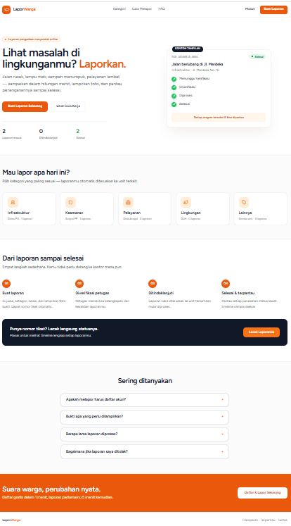
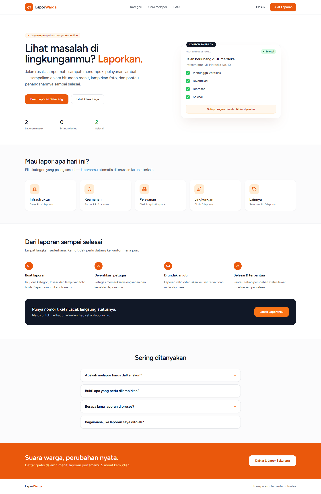
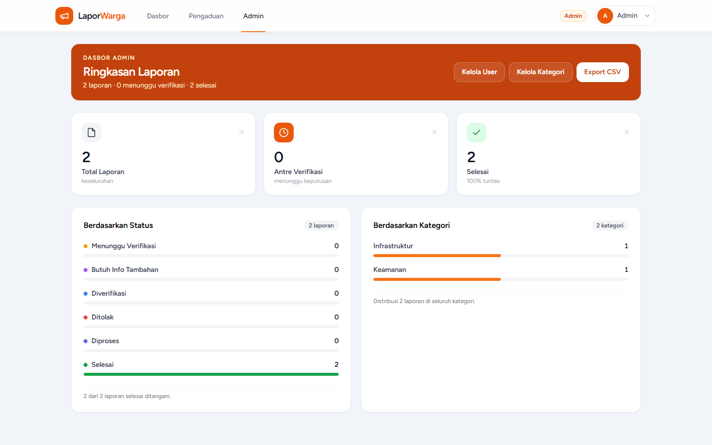
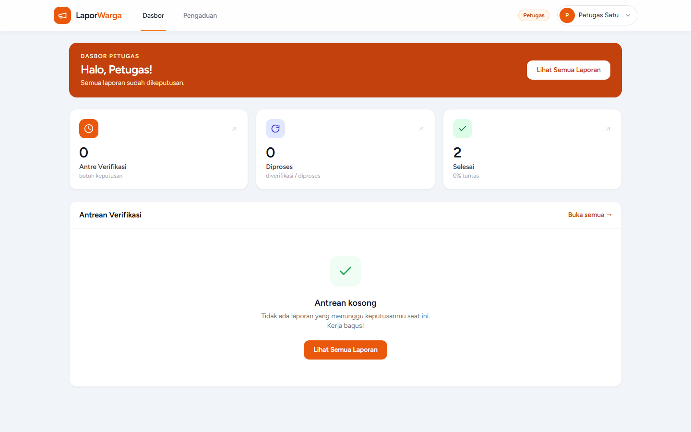
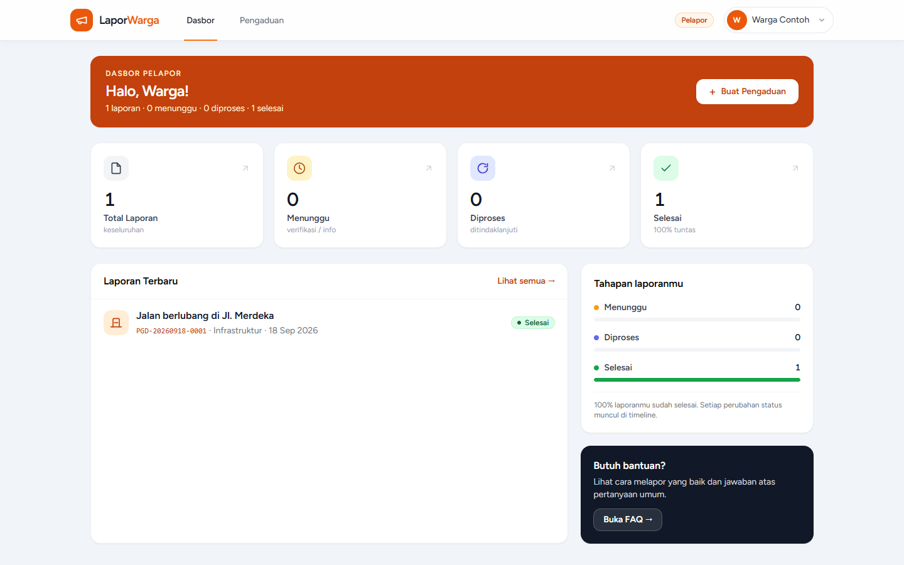

# Sistem Pengaduan Masyarakat (PRD v1.1)

Laravel 12 + Vue 3 (Inertia, monolith di `resources/js`) + SQLite (WAL).



## Tampilan aplikasi (asli, diambil dari build terbaru)

| Beranda | Dasbor Admin |
|---|---|
|  |  |

| Dasbor Petugas | Dasbor Pelapor |
|---|---|
|  |  |

## Jalankan lokal (XAMPP / PHP 8.2+)

```bash
composer install
npm install
cp .env.example .env   # jika belum ada
php artisan key:generate
php artisan migrate:fresh --seed
php artisan storage:link
npm run dev              # terminal 1 (Vite)
php artisan serve        # terminal 2 → http://127.0.0.1:8000
```

## Akun demo (password: `password`)

| Email | Role |
|---|---|
| admin@example.com | admin |
| petugas@example.com | petugas |
| warga@example.com | pelapor |

## Alur status (mengikat, via `PengaduanStatusService`)

`menunggu_verifikasi → diverifikasi → diproses → selesai`,
cabang `→ ditolak` (final) dan `→ butuh_info_tambahan ⇄ menunggu_verifikasi` (resubmit pelapor).

## Test

```bash
php artisan test --filter PengaduanFlowTest  # 3 test alur
php artisan test                             # full suite (28 test)
```

## Export CSV (admin)

`GET /admin/export/csv?status=&kategori_id=&from=&to=`
