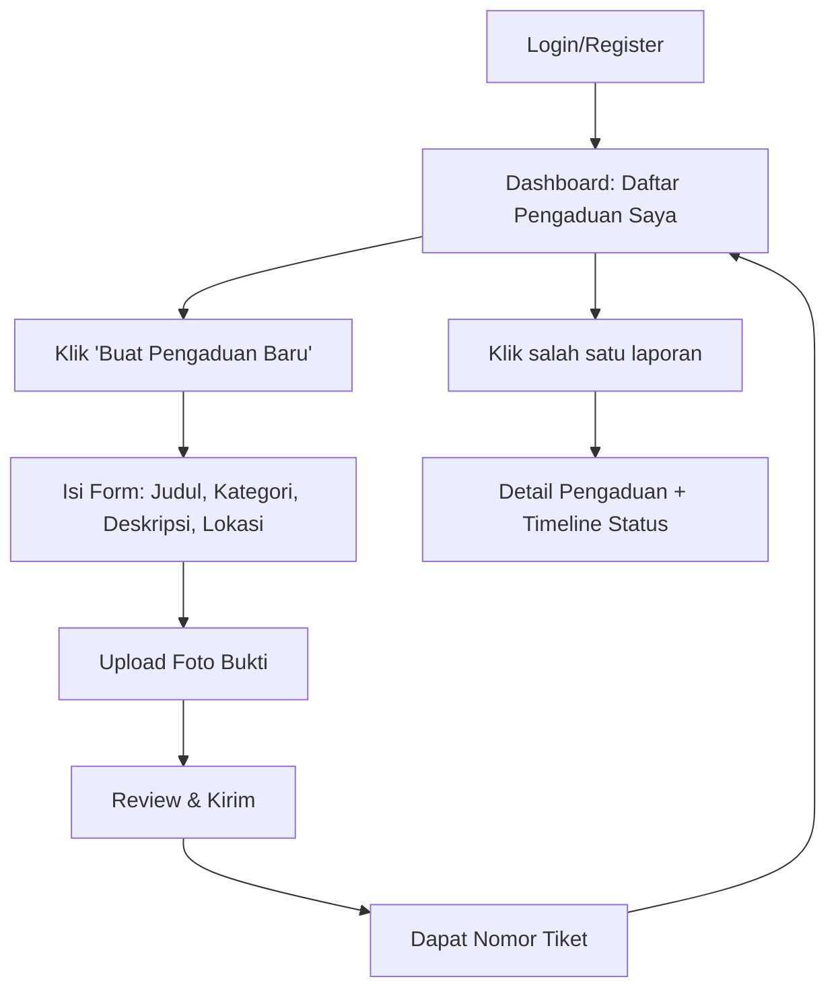
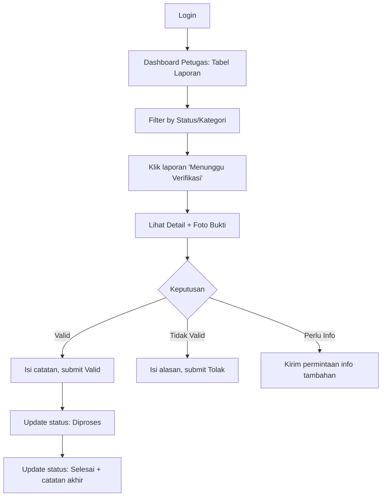
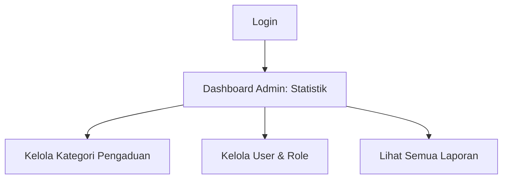

# Desain UI/UX — Sistem Pengaduan Masyarakat

**Versi Dokumen:** 1.0
**Tanggal:** 18 September 2026

---

## 1. Design System

### 1.1 Palet Warna

| Token | Hex | Penggunaan |
|---|---|---|
| `--color-primary` | `#F97316` (oranye) | Tombol utama, link aktif, highlight |
| `--color-primary-dark` | `#C2410C` | Hover/active state tombol |
| `--color-primary-light` | `#FFEDD5` | Background badge/section aksen |
| `--color-neutral-900` | `#111827` | Teks utama |
| `--color-neutral-600` | `#4B5563` | Teks sekunder |
| `--color-neutral-200` | `#E5E7EB` | Border, divider |
| `--color-neutral-50` | `#F9FAFB` | Background halaman |
| `--color-success` | `#16A34A` | Status "Selesai" |
| `--color-warning` | `#EAB308` | Status "Menunggu Verifikasi" |
| `--color-danger` | `#DC2626` | Status "Ditolak", tombol tolak |
| `--color-info` | `#2563EB` | Status "Diverifikasi" |

### 1.2 Tipografi

| Elemen | Font | Ukuran | Weight |
|---|---|---|---|
| H1 (judul halaman) | Inter/Poppins | 24–28px | 700 |
| H2 (judul section) | Inter/Poppins | 18–20px | 600 |
| Body text | Inter | 14–16px | 400 |
| Label form | Inter | 13px | 500 |
| Caption/meta (tanggal, nomor tiket) | Inter | 12px | 400 |

### 1.3 Spacing & Grid
- Base spacing unit: **4px** (gunakan kelipatan 4/8/12/16/24/32)
- Container max-width desktop: `1200px`, padding horizontal `24px`
- Mobile: single column, padding horizontal `16px`
- Card radius: `12px`, shadow tipis (`0 1px 3px rgba(0,0,0,0.1)`)

### 1.4 Komponen Dasar

| Komponen | Spesifikasi |
|---|---|
| **Button Primary** | Background oranye, teks putih, radius 8px, padding 10px 20px |
| **Button Secondary** | Border abu-abu, teks abu-abu gelap, background putih |
| **Badge Status** | Radius penuh (pill), padding 4px 12px, warna sesuai status |
| **Input Field** | Border 1px neutral-200, radius 8px, focus ring oranye |
| **Card** | Background putih, radius 12px, shadow tipis, padding 16px |

### 1.5 Ikonografi
- Gunakan satu set ikon konsisten (mis. Heroicons/Lucide): upload, kamera, lokasi, jam (status), centang (verifikasi), silang (tolak).

---

## 2. User Flow per Role

### 2.1 Alur Pelapor



### 2.2 Alur Petugas



### 2.3 Alur Admin


---

## 3. Wireframe Detail per Halaman

### 3.1 Dashboard Pelapor

```
┌─────────────────────────────────────────────┐
│ [Logo]      Sistem Pengaduan     [Nama][▼]   │  ← Header, sticky
├─────────────────────────────────────────────┤
│  Pengaduan Saya          [+ Buat Pengaduan]  │  ← oranye, kanan atas
│  [Semua ▾] [Status ▾]           [Cari...]    │  ← Filter bar
├─────────────────────────────────────────────┤
│ ┌───────────────────────────────────────┐   │
│ │ PGD-20260918-0001    [●Menunggu]       │   │  ← Card list item
│ │ Jalan rusak di depan pasar             │   │
│ │ 📅 18 Sep 2026                         │   │
│ └───────────────────────────────────────┘   │
│ ┌───────────────────────────────────────┐   │
│ │ PGD-20260910-0004    [●Selesai]        │   │
│ │ Lampu jalan mati                       │   │
│ │ 📅 10 Sep 2026                         │   │
│ └───────────────────────────────────────┘   │
│              [ Muat lebih banyak ]           │
└─────────────────────────────────────────────┘
```
**Elemen kunci:** badge status berwarna, klik card → detail. Empty state: ilustrasi + teks "Belum ada pengaduan" + CTA.

### 3.2 Form Pengaduan (Multi-step disarankan untuk mobile)

```
┌─────────────────────────────────────────────┐
│ ← Kembali        Buat Pengaduan              │
├─────────────────────────────────────────────┤
│ ● Langkah 1/3: Detail Laporan                │  ← step indicator
│                                               │
│ Judul Pengaduan                              │
│ [_________________________________]         │
│                                               │
│ Kategori                                     │
│ [ Pilih kategori          ▾ ]                │
│                                               │
│ Deskripsi                                    │
│ [                                    ]       │
│ [                                    ]       │
│                                               │
│ Lokasi                                       │
│ [ Ketik alamat / lokasi... ]  📍 Titik peta  │
│                                               │
│                         [ Lanjut → ]         │
└─────────────────────────────────────────────┘

Langkah 2: Upload Foto
┌─────────────────────────────────────────────┐
│ ● Langkah 2/3: Upload Bukti                  │
│  ┌───────────────────────────────┐           │
│  │   📷  Tarik foto ke sini       │           │
│  │   atau klik untuk pilih file   │           │
│  └───────────────────────────────┘           │
│  [thumb1] [thumb2] [thumb3] [+]              │  ← preview grid, max 5
│  Format: jpg/png, maks 2MB per foto           │
│                         [ Lanjut → ]         │
└─────────────────────────────────────────────┘

Langkah 3: Review & Kirim
┌─────────────────────────────────────────────┐
│ ● Langkah 3/3: Review                        │
│  Ringkasan data yang diisi ditampilkan ulang │
│  [Judul] [Kategori] [Deskripsi] [Lokasi]     │
│  [Preview 3 foto kecil]                      │
│                                               │
│               [ Kirim Pengaduan ]            │  ← tombol oranye full
└─────────────────────────────────────────────┘
```

### 3.3 Detail Pengaduan (Timeline)

```
┌─────────────────────────────────────────────┐
│ ← Kembali    PGD-20260918-0001  [●Menunggu]  │
├─────────────────────────────────────────────┤
│ Jalan rusak di depan pasar                   │
│ Kategori: Infrastruktur  •  18 Sep 2026      │
│ Lokasi: Jl. Raya Padang No. 12                │
│                                               │
│ Foto Bukti                                   │
│ [img] [img] [img]                            │  ← klik untuk lightbox
│                                               │
│ Riwayat Status                               │
│  ●─ Diajukan            18 Sep, 09:00        │
│  │                                            │
│  ●─ Menunggu Verifikasi 18 Sep, 09:01        │
│  │                                            │
│  ○  Diverifikasi        (belum)              │
│  │                                            │
│  ○  Diproses            (belum)              │
│  │                                            │
│  ○  Selesai             (belum)              │
└─────────────────────────────────────────────┘
```
**Catatan:** titik terisi (●) = sudah lewat, titik kosong (○) = belum terjadi; setiap titik bisa expand menampilkan catatan petugas.

### 3.4 Dashboard Petugas

```
┌─────────────────────────────────────────────┐
│ [Logo]   Panel Petugas         [Nama][▼]     │
├─────────────────────────────────────────────┤
│ [Semua][Menunggu][Diverifikasi][Diproses]    │  ← tab filter status
│ [Kategori ▾]                      [Cari...]  │
├─────────────────────────────────────────────┤
│ No.Tiket │ Judul       │ Kategori │ Status │ >│
│ PGD-0001 │ Jalan rusak │ Infra.   │ ●Wait  │ >│
│ PGD-0002 │ Sampah numpuk│ Lingk.  │ ●Baru  │ >│
├─────────────────────────────────────────────┤
│              [1] [2] [3]  →  (pagination)    │
└─────────────────────────────────────────────┘
```

### 3.5 Halaman Verifikasi

```
┌───────────────────────────────┬───────────────┐
│ Detail Laporan                │ Aksi Verifikasi│
│ PGD-20260918-0001             │                │
│ Jalan rusak di depan pasar    │ ○ Valid        │
│ Deskripsi: ...                │ ○ Tidak Valid  │
│ Lokasi: ...                   │ ○ Perlu Info   │
│                                │                │
│ [foto][foto][foto]             │ Catatan:       │
│                                │ [___________]  │
│                                │                │
│                                │ [ Submit ]     │  ← oranye
└───────────────────────────────┴───────────────┘
```
**Mobile:** panel aksi pindah ke bawah (stack vertikal), tombol submit sticky di bawah layar.

### 3.6 Dashboard Admin

```
┌─────────────────────────────────────────────┐
│ [Logo]   Panel Admin           [Nama][▼]     │
├─────────────────────────────────────────────┤
│ [Total: 128] [Menunggu: 12] [Selesai: 90]    │  ← kartu ringkasan
├───────────────────┬───────────────────────────┤
│ Grafik per Status  │ Grafik per Kategori       │  ← chart
│  (bar chart)       │  (pie chart)              │
├───────────────────┴───────────────────────────┤
│ Kelola Kategori          Kelola User           │  ← 2 tab/section
└─────────────────────────────────────────────┘
```

---

## 4. States & Interaksi

| State | Perlakuan |
|---|---|
| **Loading** | Skeleton loader pada card/tabel, spinner oranye pada tombol saat submit |
| **Empty state** | Ilustrasi ringan + teks + CTA (mis. "Belum ada pengaduan" → tombol "Buat Pengaduan") |
| **Error validasi form** | Border merah pada input, pesan error di bawah field (bukan alert popup) |
| **Error upload foto** | Toast merah: "Ukuran file melebihi 2MB" |
| **Sukses submit** | Toast hijau + redirect ke halaman detail/dashboard |
| **Konfirmasi aksi kritikal** | Modal konfirmasi untuk "Tolak Laporan" sebelum submit final |

---

## 5. Responsive Breakpoint

| Breakpoint | Lebar | Perubahan Layout |
|---|---|---|
| Mobile | < 640px | Single column, nav jadi hamburger, panel verifikasi jadi stack |
| Tablet | 640–1024px | 2 kolom untuk card list, sidebar collapsible |
| Desktop | > 1024px | Layout penuh (sidebar + konten + panel aksi berdampingan) |

## 6. Aksesibilitas Singkat
- Kontras teks minimal WCAG AA (terutama teks di atas badge oranye — gunakan teks putih/gelap sesuai kontras).
- Semua ikon aksi (upload, hapus foto) disertai label teks/aria-label.
- Form wajib punya `<label>` yang terhubung ke input, bukan hanya placeholder.
