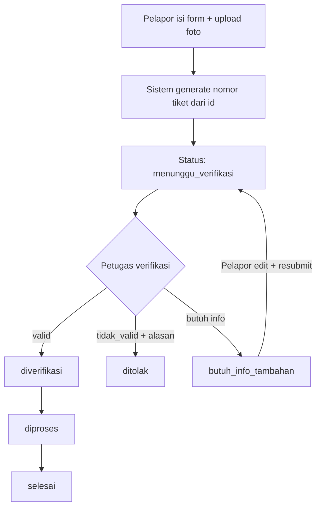
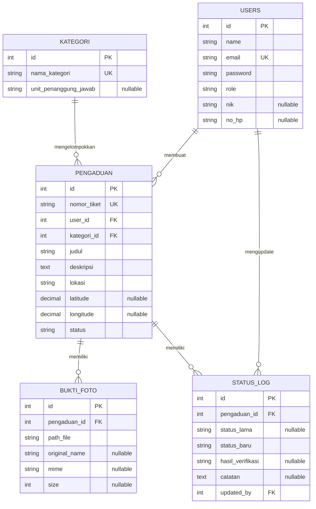

# PRD — Sistem Pengaduan Masyarakat

**Tech Stack:** Laravel 12 · Vue.js 3 (monolith di `resources/js`) · SQLite (WAL)
**Versi Dokumen:** 1.1
**Tanggal:** 18 September 2026
**Perubahan dari v1.0:** hapus status `diajukan`, hapus tabel `verifikasi` (merge ke `status_log`), hapus tabel `units`, tambah flow `butuh_info_tambahan`, tambah export CSV, kunci arsitektur monolith + Sanctum cookie.

---

## 1. Ringkasan Produk

Platform web untuk masyarakat mengajukan laporan/pengaduan (fasilitas umum, pelayanan, lingkungan) secara online, melampirkan 1–5 foto bukti, lalu memantau status tindak lanjut via timeline. Petugas memverifikasi dan memproses hingga selesai. Admin melihat statistik + export CSV.

## 2. Tujuan & Sasaran

- Pengaduan tanpa datang ke instansi.
- Bukti foto agar laporan valid.
- Transparansi status via timeline.
- Pengelolaan terstruktur + audit trail.

## 3. Target Pengguna & Role

| Role | Deskripsi | Dibuat via |
|---|---|---|
| **Pelapor** | Ajukan pengaduan, upload bukti, pantau miliknya | Register publik |
| **Petugas** | Verifikasi + proses **semua** laporan (global queue, tanpa assignment per unit) | Seeder / Admin CRUD |
| **Admin** | Statistik, export CSV, CRUD user & kategori | Seeder |

## 4. State Machine Final (mengikat)

```
menunggu_verifikasi --(valid)--> diverifikasi --(*)--> diproses --(*)--> selesai
                    --(tidak_valid)--> ditolak [final]
                    --(butuh_info)--> butuh_info_tambahan --(pelapor edit+resubmit)--> menunggu_verifikasi
```

- Enum `pengaduan.status`: `menunggu_verifikasi, butuh_info_tambahan, diverifikasi, ditolak, diproses, selesai`.
- `ditolak` dan `selesai` adalah final (tidak bisa pindah lagi).
- Transisi HANYA via `PengaduanStatusService::transition()` yang menulis `status_log` dalam 1 DB transaction.
- Matrix izin:

| Dari \ Ke | diverifikasi | ditolak | butuh_info_tambahan | menunggu_verifikasi (resubmit) | diproses | selesai |
|---|---|---|---|---|---|---|
| menunggu_verifikasi | petugas | petugas | petugas | — | — | — |
| butuh_info_tambahan | — | — | — | pelapor (owner) | — | — |
| diverifikasi | — | — | — | — | petugas/admin | — |
| diproses | — | — | — | — | — | petugas/admin |
| ditolak / selesai | — | — | — | — | — | — |

## 5. Fitur & User Story

### 5.1 Pengajuan Pengaduan
- Pelapor isi: judul, kategori, deskripsi, lokasi (teks wajib; lat/long opsional via map picker).
- Sistem generate `nomor_tiket` format `PGD-YYYYMMDD-XXXX` di mana `XXXX = str_pad(pengaduan.id, 4, '0', STR_PAD_LEFT)` (anti-race, tanpa counter harian).
- Rate limit: `throttle:5,60` (maks 5 pengaduan/jam/user).
- Status awal selalu `menunggu_verifikasi`.

### 5.2 Upload Bukti / Foto
- 1–5 file, `mimes:jpg,jpeg,png`, maks 2MB/file.
- Preview sebelum submit, lazy load di daftar/galeri.
- Simpan di `storage/app/public/pengaduan/{nomor_tiket}/{uuid}.{ext}` + `php artisan storage:link`.
- Simpan metadata: `original_name, mime, size`.
- Hapus folder fisik saat pengaduan dihapus (`Observer::deleting`).

### 5.3 Verifikasi + Tindak Lanjut (gabung)
- Petugas input: `hasil ∈ {valid, tidak_valid, butuh_info}` + `catatan` (wajib jika tidak_valid/butuh_info).
- Mapping: `valid → diverifikasi`, `tidak_valid → ditolak`, `butuh_info → butuh_info_tambahan`.
- Jika `butuh_info_tambahan`: pelapor boleh edit (judul/deskripsi/lokasi/foto) lalu resubmit → kembali `menunggu_verifikasi`. Tercatat di `status_log`.
- Petugas/admin pindahkan `diverifikasi → diproses → selesai` dengan catatan tindak lanjut.
- Timeline di halaman detail: semua `status_log` + nama updater + timestamp.

### 5.4 Admin & Export
- Statistik: `SELECT status, COUNT(*) GROUP BY status` + `JOIN kategori GROUP BY nama_kategori`.
- Export CSV native (`StreamedResponse + fputcsv`, filter `?status=&kategori_id=&from=&to=`). Kolom: nomor_tiket, tanggal, pelapor, kategori, judul, status, updater_terakhir.
- CRUD `kategori_pengaduan` (nama + `unit_penanggung_jawab` string nullable, tanpa tabel units terpisah).
- CRUD `users` role petugas/admin. Tidak ada registrasi publik selain pelapor.

## 6. Alur Proses



## 7. Kebutuhan Non-Fungsional

- **Auth**: Sanctum SPA cookie-based (stateful, Vue di `resources/js`). `auth:sanctum` + `RoleMiddleware (role:pelapor,petugas,admin)` + `PengaduanPolicy` (pelapor hanya milik sendiri).
- **Keamanan**: validasi file, CSRF (Sanctum), rate limit form + upload `throttle:10,1`.
- **Performa**: pagination 10–15/page, lazy load gambar, indeks DB (lihat §8), SQLite `PRAGMA journal_mode=WAL`.
- **Responsif**: mobile-first (Tailwind), pelapor mayoritas via HP.
- **Audit trail**: tiap transisi wajib 1 baris `status_log` (`status_lama, status_baru, catatan, updated_by`).

## 8. Desain Basis Data (SQLite)

### 8.1 ERD



### 8.2 Tabel

**users** — `id, name, email unique, password, role enum(pelapor,petugas,admin) default pelapor, nik nullable, no_hp nullable, rememberToken, timestamps`

**kategori_pengaduan** — `id, nama_kategori unique, unit_penanggung_jawab nullable, timestamps`

**pengaduan** — `id, nomor_tiket unique, user_id FK cascade, kategori_id FK restrict, judul, deskripsi, lokasi, latitude decimal(10,8) nullable, longitude decimal(11,8) nullable, status enum(menunggu_verifikasi,butuh_info_tambahan,diverifikasi,ditolak,diproses,selesai) default menunggu_verifikasi, timestamps, INDEX(status), INDEX(user_id), INDEX(kategori_id)`

**bukti_foto** — `id, pengaduan_id FK cascade, path_file, original_name nullable, mime nullable, size nullable, timestamps`

**status_log** — `id, pengaduan_id FK cascade, status_lama nullable, status_baru, hasil_verifikasi enum(valid,tidak_valid,butuh_info) nullable, catatan nullable, updated_by FK, created_at` (tanpa `updated_at`)

> Tidak ada tabel `verifikasi` (digabung ke `status_log`) dan tidak ada tabel `units` (cukup kolom `unit_penanggung_jawab`). — ponytail: tambah tabel units saat instansi >10 & perlu assignment per unit.

## 9. Arsitektur

- **Monolith**: Laravel 12 + Vue 3 (Composition API) di `resources/js` via Vite. Sanctum cookie. Tidak ada SPA terpisah / token manual.
- **Service**: `app/Services/PengaduanStatusService.php` — satu-satunya tempat mutasi status.
- **Struktur**:
  ```
  app/Http/Controllers/{AuthController,PengaduanController,VerifikasiController,AdminController}.php
  app/Http/Requests/{StorePengaduanRequest,UpdatePengaduanRequest,VerifikasiRequest}.php
  app/Http/Middleware/RoleMiddleware.php
  app/Models/{User,Pengaduan,KategoriPengaduan,BuktiFoto,StatusLog}.php
  app/Policies/PengaduanPolicy.php
  app/Observers/PengaduanObserver.php
  app/Services/PengaduanStatusService.php
  routes/{web.php,api.php} (api di bawah auth:sanctum)
  resources/js/{views,components,stores,router}/
  ```

### API Kontrak

```
POST /login, /register (hanya pelapor), /logout | GET /user
GET/POST /api/pengaduan
GET /api/pengaduan/{nomor_tiket}
PUT /api/pengaduan/{id}            # hanya owner + status butuh_info_tambahan
POST /api/pengaduan/{id}/foto
POST /api/pengaduan/{id}/verifikasi  {hasil, catatan}
POST /api/pengaduan/{id}/status      {status_baru: diproses|selesai, catatan}
GET /api/admin/statistik
GET /api/admin/export/csv?status=&kategori_id=&from=&to=
apiResource /api/admin/kategori, /api/admin/users (role:admin)
```

## 10. UI

| Halaman | Role | Isi |
|---|---|---|
| Login/Register | Semua | Form; register hanya pelapor |
| Dashboard Pelapor | Pelapor | Daftar milik saya + "Buat Pengaduan" |
| Form Pengaduan | Pelapor | Judul, kategori, deskripsi, lokasi, drag&drop foto + preview |
| Detail Pengaduan | Pelapor/Petugas | Info + galeri + `StatusTimeline.vue` |
| Dashboard Petugas | Petugas | Tabel + filter status/kategori/tanggal/keyword |
| Halaman Verifikasi | Petugas | Detail + foto + form {hasil, catatan} |
| Dashboard Admin | Admin | Chart per status/kategori + tabel + tombol Export CSV |
| Kelola Kategori/User | Admin | CRUD sederhana |

Warna: oranye (CTA/aksen) + netral abu/putih.

## 11. Task (5 Fase)

- [ ] **Fase 1 — Setup & Auth**: Laravel 12 + SQLite WAL + Breeze/Vue + Sanctum, semua migration §8, `RoleMiddleware`, `PengaduanPolicy`, seeder (1 admin, 2 petugas, 3 pelapor, 5 kategori), Login/Register, `storage:link`.
- [ ] **Fase 2 — Core Pengaduan**: model + `PengaduanStatusService` + tiket dari id + CRUD + Pinia store + List/Detail.
- [ ] **Fase 3 — Foto**: validasi `array|max:5|mimes:jpg,jpeg,png|max:2048`, `UploadDropzone.vue`, galeri lazy.
- [ ] **Fase 4 — Verifikasi & Timeline**: transisi + guard matrix §4 + edit-resubmit + `StatusTimeline.vue` + filter petugas.
- [ ] **Fase 5 — Admin & Polish**: statistik groupBy + Chart.js + CRUD kategori/user + export CSV + responsive + seeder demo + README.

## 12. Catatan

- SQLite cukup untuk akademik/demo; migrasi ke MySQL/PG tinggal ganti `DB_CONNECTION` karena migration database-agnostic.
- Skipped: tabel `units`, notifikasi email (tambah saat dibutuhkan via `notifications` + queue `database`), export Excel (CSV cukup), assignment petugas per unit.
